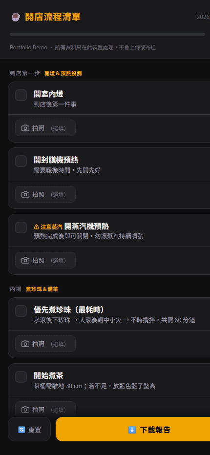
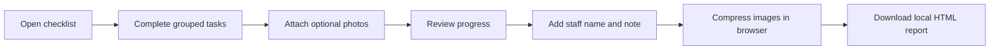

# Opening Procedure Checklist

A mobile-first opening SOP checklist with progress tracking, photo evidence, in-browser image compression, and privacy-safe local report downloads.

行動優先的開店 SOP 清單：把紙本／口頭流程轉成可勾選、可拍照、可追蹤進度並可下載報告的瀏覽器工具。

[Live demo](https://zhanchanhan.github.io/opening_procedure/) · [AI development notes](docs/ai-development-log.md)

> Portfolio Demo：公開版本不包含寄信服務、API key 或真實門市收件資訊。



## Problem

門市開店包含設備預熱、備料、收銀、清潔與最後確認。紙本或口頭交接容易造成：

- 步驟順序不一致或遺漏。
- 無法快速看到整體完成度。
- 照片散落在通訊軟體，難以對應到具體任務。
- 臨時製作報告增加當班人員負擔。

這個原型把流程整理成適合手機單手操作的任務卡，並讓使用者在不安裝 App、不建立帳號的情況下完成當日紀錄。

## Demo flow



## Features

- Five SOP sections covering arrival, preparation, front-of-house, environment, and final confirmation.
- Live completion count, progress bar, and all-done state.
- Mobile camera/image upload with thumbnail preview and deletion.
- Canvas-based image compression before report generation.
- Downloadable, self-contained HTML report with task status and optional photos.
- Keyboard-operable checklist items with checkbox semantics.
- Zero backend, zero account, and zero data upload in the public demo.

## Engineering choices

| Choice | Why | Trade-off |
|---|---|---|
| Vanilla HTML/CSS/JavaScript | No build step; deploys anywhere as a static page | A larger product should split data, UI, state, and report modules |
| Mobile-first layout | The primary use case happens on a phone while moving through a store | Desktop layout is intentionally secondary |
| Canvas image compression | Keeps the downloadable report small without a server | Compression time and output quality vary by device |
| Local-only report generation | Safe public demo with no credentials or personal-data transfer | Does not provide centralized records or manager delivery |
| Static GitHub Pages deployment | Free, inspectable, and easy for interviewers to try | Cannot support protected production workflows |

## Privacy and security

The first prototype used a browser email service. The portfolio version deliberately removes that integration because public frontend code cannot safely control recipients, rate limits, or operational credentials.

Current public behavior:

- No EmailJS or external reporting SDK.
- No hard-coded recipient, service ID, template ID, or public key.
- No network request when generating a report.
- Staff name, notes, checklist state, and photos stay on the current device.
- The downloaded report states that it was generated locally.

A production version should use an authenticated backend, role-based recipients, server-side validation, rate limiting, retention rules, and an audit log.

## AI-assisted development

AI was used to accelerate workflow decomposition, UI implementation, image-handling exploration, documentation, and security review. Human responsibility remained with requirements, trade-off decisions, privacy boundaries, and verification.

The repository records three representative examples in [`docs/ai-development-log.md`](docs/ai-development-log.md):

1. Turning an operational SOP into structured, grouped tasks.
2. Handling photo size limits with browser-side compression.
3. Replacing a public email integration with a local-only portfolio workflow.

## Run locally

No dependencies are required.

```powershell
python -m http.server 8000
```

Open `http://localhost:8000`.

You can also open `index.html` directly, although a local static server more closely matches GitHub Pages.

## Manual verification

- [ ] Complete and uncomplete tasks; confirm progress is correct.
- [ ] Use Enter and Space on focused task cards.
- [ ] Attach, preview, and remove photos.
- [ ] Complete all 16 tasks and confirm the completion banner appears.
- [ ] Try to download without a staff name and confirm validation appears.
- [ ] Download a report with notes and photos, then open it offline.
- [ ] Confirm browser developer tools show no report-related network request.
- [ ] Check the flow on iOS Safari, Android Chrome, and desktop Chrome.

## What I would build next

- Move checklist content into configurable JSON.
- Persist state by business date instead of resetting every session.
- Add automated unit tests for progress and report generation.
- Add browser-level accessibility and download-flow tests.
- Build an authenticated production API only when a real reporting workflow is required.

## Repository structure

```text
index.html                    Complete static application
docs/ai-development-log.md   AI collaboration and validation examples
.github/workflows/pages.yml  GitHub Pages deployment
```

## Summary

> I used a real operational workflow to build a zero-install mobile prototype. The interesting engineering constraint was photo handling: images needed to remain useful while staying small enough for a portable report. The public version also demonstrates product judgment—an email integration was removed and replaced with local-only generation because a portfolio demo should not expose operational recipients or credentials.

## License

No license is granted. The source is public for portfolio review; reuse and redistribution require permission from the repository owner.
